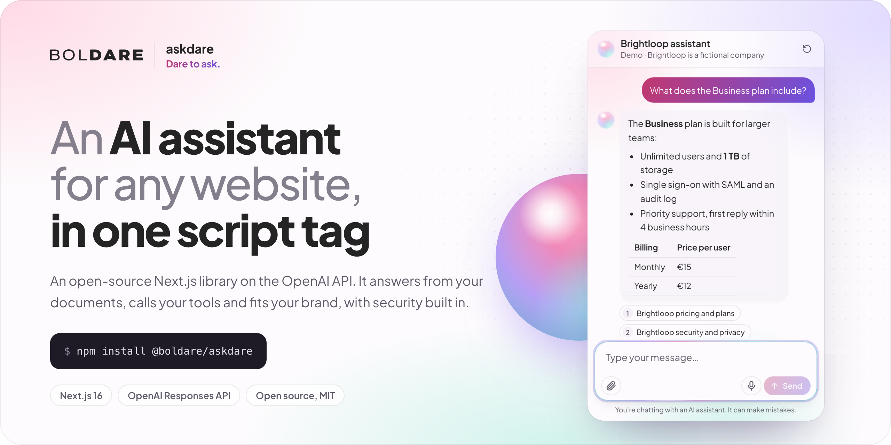
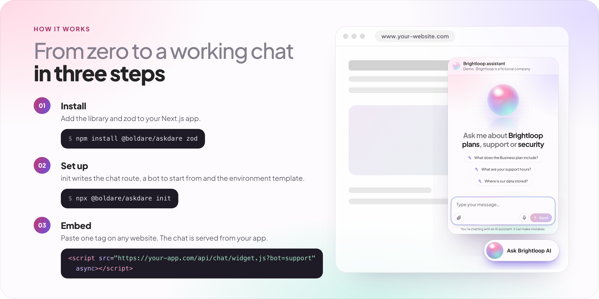
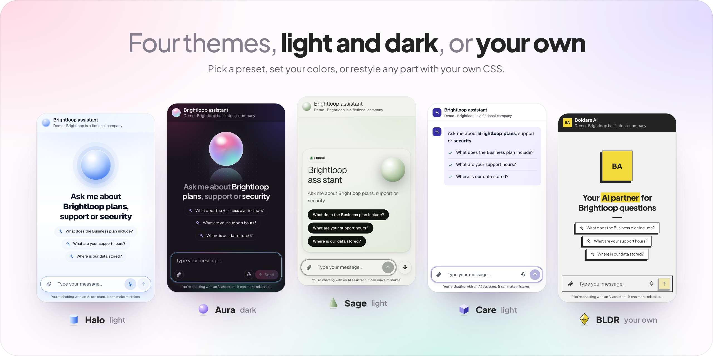

# @boldare/askdare

[](https://askdare.vercel.app)

**Dare to ask.** An AI chatbot for any website, served by your Next.js app on the official OpenAI SDK. One route, one script tag, no database required.

**[Live demo](https://askdare.vercel.app)** · **[Deploy in 5 minutes](https://askdare.vercel.app/deploy)** · **[Documentation](https://askdare.vercel.app/docs)** · [GitHub](https://github.com/boldare/askdare) · [Changelog](https://github.com/boldare/askdare/blob/main/packages/askdare/CHANGELOG.md)

## Three steps

[](https://askdare.vercel.app/docs/getting-started)

In a Next.js 16 app:

```bash
npm install @boldare/askdare zod
npx @boldare/askdare init
```

`init` writes the chat route, a bot to start from and `.env.local`, and adds the chat to your layout. Put your OpenAI key and model in `.env.local`, run the app, and the chat is there. The bot is a few lines you own:

```ts
// askdare.config.ts
import { defineBot } from '@boldare/askdare';

export const bots = [
  defineBot({
    id: 'support',
    model: process.env.ASKDARE_MODEL ?? '',
    instructions: 'You answer questions about our product. If you do not know, say so.',
    security: { allowedOrigins: ['https://www.example.com'] },
    widget: { theme: 'aura', greeting: 'Hi! How can I help?' },
  }),
];
```

**[Getting started](https://askdare.vercel.app/docs/getting-started)** takes you from an empty app to a working chat in about 15 minutes.

## What you get

[![What it does: answers from your documents with citations, your own tools, images and PDFs, voice input, secure by default, the chat inside your own page with React, thumbs-up and thumbs-down ratings of answers, observability with OpenTelemetry, and chat events for analytics. Also clickable answers suggested by the model, reply options from your tools, switching the chat's language from the page, a one-click deploy, tool cards drawn by your own React components, your own page inside the widget, and texts per language. New in 0.5: guardrails with OpenAI moderation and your own rules, a human check with Cloudflare Turnstile, seven built-in languages, and WCAG 2.2 AA. No database.](https://raw.githubusercontent.com/boldare/askdare/main/.github/assets/askdare-features.png)](https://askdare.vercel.app/#features)

[Knowledge base](https://askdare.vercel.app/docs/knowledge-base) · [Tools](https://askdare.vercel.app/docs/tools) · [Tool cards](https://askdare.vercel.app/docs/react#tool-cards) · [Reply options](https://askdare.vercel.app/docs/reply-options) · [Attachments](https://askdare.vercel.app/docs/attachments) · [Voice input](https://askdare.vercel.app/docs/voice-input) · [The chat inside your page (React)](https://askdare.vercel.app/docs/react) · [Your own page in the widget](https://askdare.vercel.app/docs/embedding#your-own-page-in-the-iframe) · [Answer ratings](https://askdare.vercel.app/docs/feedback) · [Handoff to a person](https://askdare.vercel.app/docs/handoff) · [Forms and leads](https://askdare.vercel.app/docs/forms) · [Admin console and dashboard](https://askdare.vercel.app/docs/admin) · [Launcher greeting](https://askdare.vercel.app/docs/embedding#a-greeting-and-an-unread-badge) · [Guardrails](https://askdare.vercel.app/docs/guardrails) · [Accessibility](https://askdare.vercel.app/docs/accessibility) · [Own your data](https://askdare.vercel.app/docs/own-your-data) · [Security](https://github.com/boldare/askdare/blob/main/THREAT_MODEL.md)

**New in 0.7, support-grade:**

- **Handoff to a person**: a "Talk to a person" button and a `handoff` tool the model calls when it can't help, with `webhookHandoff()` (signed with Standard Webhooks) or `emailHandoff()` delivering the request. It is one-way: a person from your team answers the visitor by email. Outside your office hours, the handoff's form takes a message instead. See [Handoff](https://askdare.vercel.app/docs/handoff).
- **Forms in the chat**: `defineForm` with text, email, phone, select, textarea and consent fields, validated on the server and drawn by the widget with no code on your site. Each sent form goes to your `onLead`, and its values reach the model only for the fields you mark. See [Forms](https://askdare.vercel.app/docs/forms).
- **Admin console and dashboard**: a console at `/api/chat/admin`, off by default, with each bot's configuration, `doctor`, a playground and conversation reviews, signed in with `ADMIN_SECRET` or an identity token. Records live in an admin store (memory, Postgres or Upstash), and the new [`@boldare/askdare-admin`](https://www.npmjs.com/package/@boldare/askdare-admin) adds a dashboard: cost per bot, day and model, ratings, unanswered questions, leads and handoffs. Deleting a conversation deletes its records. See [Admin](https://askdare.vercel.app/docs/admin).
- **A greeting next to the launcher and an unread badge**: `widget.launcherGreeting` invites visitors after a few seconds, and answers that arrive while the chat is closed are counted on the launcher. See [Embedding](https://askdare.vercel.app/docs/embedding#a-greeting-and-an-unread-badge).

**New in 0.6, own your data:**

- **Conversations in your own Postgres**: `postgresConversations()` from the new [`@boldare/askdare-postgres`](https://www.npmjs.com/package/@boldare/askdare-postgres), with `migrate` for the tables and a sweep for your retention. Turns go to OpenAI with `store: false`: it still processes every request, but keeps no conversation. See [Own your data](https://askdare.vercel.app/docs/own-your-data).
- **Knowledge in pgvector**: `pgvectorIndex` with `askdare kb sync --index`, searched by the built-in `search_knowledge` tool, with the same cited sources and no per-search fee. See [Knowledge base](https://askdare.vercel.app/docs/knowledge-base#your-own-index).
- **Answers that survive a dropped connection**: the chat picks an answer up where it stopped, from memory on one server or from Upstash on several (`upstashTurnLog()`). See [Configuration](https://askdare.vercel.app/docs/configuration#resume).
- **The whole history**: older messages load in pages as the visitor scrolls up (`LoadEarlier`). See [React](https://askdare.vercel.app/docs/react#long-conversations).
- **Compaction and transcripts**: opt-in `limits.compactAt` keeps long conversations in your store affordable, and `onTranscript` hands each finished turn to your code. See [Configuration](https://askdare.vercel.app/docs/configuration#compaction).
- **Still at OpenAI**: OpenAI processes every model request, and attachments stay in OpenAI Files. See [What stays at OpenAI](https://askdare.vercel.app/docs/own-your-data#what-stays-at-openai) and the [changelog](https://github.com/boldare/askdare/blob/main/packages/askdare/CHANGELOG.md).


## Themes

[](https://askdare.vercel.app/#themes)

Pick a theme, set your brand's colors, or restyle any part with your own CSS, the way BLDR does. Switch between them on the [website](https://askdare.vercel.app/#themes), then read [Themes](https://askdare.vercel.app/docs/themes) and [Styling](https://askdare.vercel.app/docs/styling).

## Documentation

The guides are on [askdare.vercel.app/docs](https://askdare.vercel.app/docs), with search. They also ship in this package, in `node_modules/@boldare/askdare/docs/`, so they match the version you installed.

- **Start:** [Getting started](https://askdare.vercel.app/docs/getting-started) · [Embedding the chat](https://askdare.vercel.app/docs/embedding) · [Command line](https://askdare.vercel.app/docs/cli)
- **Look and language:** [Themes](https://askdare.vercel.app/docs/themes) · [Styling](https://askdare.vercel.app/docs/styling) · [Texts](https://askdare.vercel.app/docs/texts) · [The chat inside your page (React)](https://askdare.vercel.app/docs/react)
- **Going live:** [Deployment](https://askdare.vercel.app/docs/deployment) · [Own your data](https://askdare.vercel.app/docs/own-your-data) · [Going-public checklist](https://askdare.vercel.app/docs/going-public) · [Guardrails](https://askdare.vercel.app/docs/guardrails) · [Costs](https://askdare.vercel.app/docs/costs) · [Observability](https://askdare.vercel.app/docs/observability) · [Chat events](https://askdare.vercel.app/docs/events) · [Answer ratings](https://askdare.vercel.app/docs/feedback) · [Handoff to a person](https://askdare.vercel.app/docs/handoff) · [Forms and leads](https://askdare.vercel.app/docs/forms) · [Admin console and dashboard](https://askdare.vercel.app/docs/admin) · [Privacy](https://askdare.vercel.app/docs/privacy) · [Compliance](https://askdare.vercel.app/docs/compliance) · [Accessibility](https://askdare.vercel.app/docs/accessibility)
- **Reference:** [Configuration](https://askdare.vercel.app/docs/configuration) · [Troubleshooting](https://askdare.vercel.app/docs/troubleshooting) · [Support matrix](https://askdare.vercel.app/docs/support)
- **AI coding agents:** `llms.txt` and the `askdare` skill ship in the package ([how to use them](https://askdare.vercel.app/docs/getting-started#working-with-an-ai-coding-agent))

## Add-ons

| Package | What it adds |
| --- | --- |
| [`@boldare/askdare-upstash`](https://www.npmjs.com/package/@boldare/askdare-upstash) | Rate limits, budgets and answer resume shared by every server instance, in Upstash Redis |
| [`@boldare/askdare-postgres`](https://www.npmjs.com/package/@boldare/askdare-postgres) | Conversations and a pgvector knowledge index in your own Postgres |
| [`@boldare/askdare-otel`](https://www.npmjs.com/package/@boldare/askdare-otel) | OpenTelemetry spans for every chat turn, following the GenAI conventions |

## Requirements

Node.js 22, 24 or 26, Next.js 16 with the App Router on the Node.js runtime, React 19 and zod 4.1 or later.

## License

MIT © [Boldare](https://www.boldare.com)
